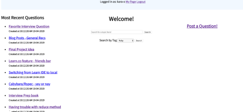
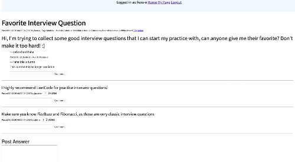

# Flatiron Stack Overflow

### Abstract

For my Flatiron School Module Two solo project, I built a simple full Rails web app designed after Stack Overflow, for the Flatiron School community.  My app uses an MVC structure and RESTful conventions. 

### Built With

- Ruby on Rails, using a PostgreSQL database

### How to Run

In your terminal navigate to the directory where you want to save the game files, then enter and run each step:

1. `git clone git@github.com:kara-o/f_stack.git`
1. `cd f_stack`
1. `bundle install`
1. `rails db:create && rails db:migrate && rails db:seed`
1. `rails s`

### Screenshots

  

 
<em>Login</em>

  

  
 
<em>Home page</em>

  

 
<em>Page view for a selected question, showing posted answers, comments, upvotes</em>

  

 
<em>User profile page</em>

