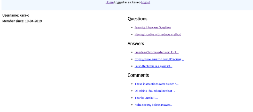

# Flatiron Stack Overflow

A simple full Rails web app designed after Stack Overflow, for the Flatiron School community.

## Built With

- Ruby on Rails, using a PostgreSQL database

## Screenshots

  
  
  
  

